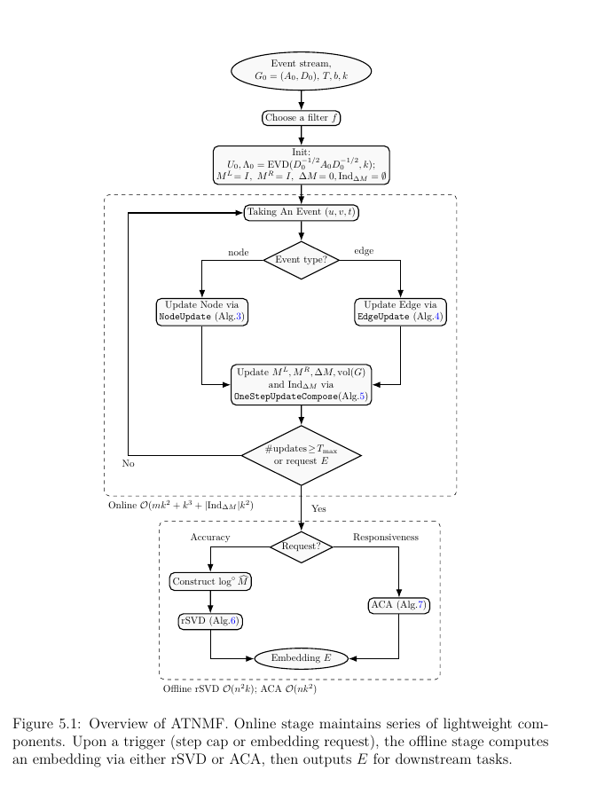

# A Temporal Network Embedding Method with Error Bound
This dissertation, supervised by Prof. Renaud Lambiotte, is submitted for the degree of MSc in Mathematical Modelling and Scientific Computing in the University of Oxford. This disseration proposed a new matrix-factorisation based embedding method for temporal (or dynamic) networks. The main results are 

1. **Theorem 6** (One Step Node Update of Normalised Adjacency Matrix)
2. **Theorem 7** (One Step Edge Update of Normalised Adjacency Matrix)
3. **Theorem 8** (One Step Error)
4. **Theorem 9** (Mulit-Step Error)

The flowchart of ATNMF is shown in Figure 5.1

Specific algorithms are achieved by Algorithm 3, Algorithm 4, Algorithm 5. 

The oline update time complexity can achieve $O(mk^2 + k^3 + |Ind_{\Delta M}|k^2)$, for $m, k \ll n$, the number of nodes, $|Ind_{\Delta M}|$ is the number of nonzero rows of row sparse matrix $\Delta M$.
